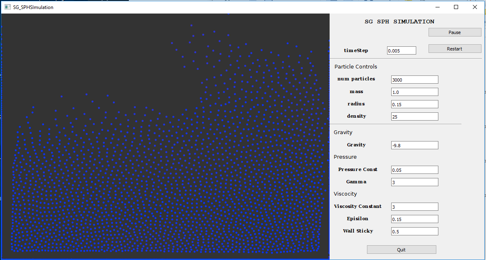

# SPHSimulation

This is a study on the smooth particle Hydrodynamics(SPH) and using QT 5.10 for UI

 

 To build this you would require Visual Studio 2015 and QT 5.10 
Note: It doesn't build in Visual Studio 2017 and QT 5.10 for me. I would have to do a complete fresh install and I don't have the time or motivation at the moment do that.

This solver simulates an Lagrangian Smooth Particle Hydrodynamics (SPH).
To understand the implementation in detail Refer to the notes by Bridson (https://www.cs.ubc.ca/~rbridson/fluidsimulation/fluids_notes.pdf)  
 Since Euler Integration is very unstable, I incorporate two other stable advection schemes:
- Leap Frog Advection 
- Sixth Advection
 
 These schemes give stable performance(especially sixth) even >10000 particles.
This program also allows for viscocity, pressure and other forces.
This is also optimized with an occupancy grid so only searches within a certain neighbouring grids for points.
